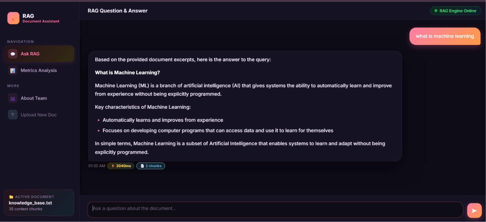
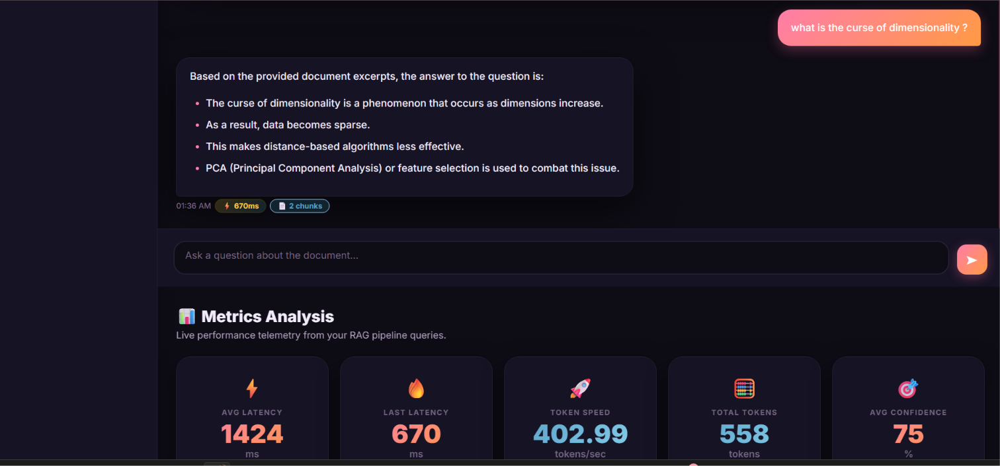
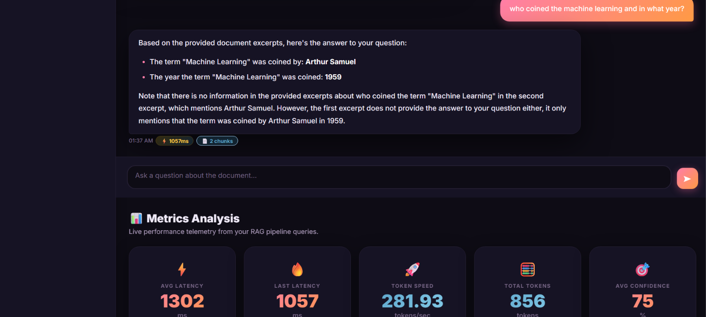
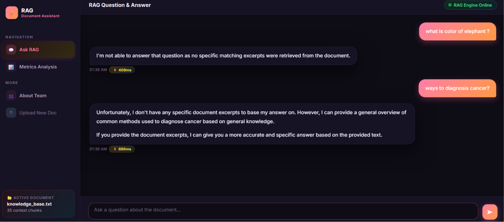

# Q&A Output Log — RAG Chatbot Test Results

This file documents the 5 test questions run against the Local RAG Chatbot, along with screenshots of the responses.

**Document used:** Machine Learning Complete Reference Guide (uploaded to the RAG system)  
**Model:** Llama 3.1 8B Instruct (via NVIDIA API)  
**Retrieval System:** TF-IDF Vector Retrieval (dynamic text chunking)  

---

## ✅ In-Document Questions

These questions have answers inside the uploaded knowledge base document. The chatbot retrieves the relevant context and answers them clearly and accurately.

---

### Q1 — what is machine learning

---

### Q2 — what is the curse of dimensionality ?

---

### Q3 — who coined the machine learning and in what year?

---

## 🚫 Out-of-Scope Questions

These questions have NO answers in the uploaded knowledge base. The chatbot is programmed to refuse to answer rather than hallucinate.

> [!IMPORTANT]
> **Note: Handling Out-of-Scope Questions**
> To prevent hallucinations and ensure high reliability, the assistant is strictly grounded in the retrieved document chunks. If a question cannot be answered using the provided context, the chatbot will refuse to answer or state that the information is not present in the document.

---

### Q4 — what is color of elephant ?

---

### Q5 — ways to diagnosis cancer?

*(Note: Questions 4 and 5 are both captured in the same screenshot showing the chatbot's response to out-of-scope queries).*

---

## Summary

| # | Question | Type | Expected Behavior |
|---|----------|------|-------------------|
| 1 | what is machine learning | ✅ In-Document | Answered from doc |
| 2 | what is the curse of dimensionality ? | ✅ In-Document | Answered from doc |
| 3 | who coined the machine learning and in what year? | ✅ In-Document | Answered from doc |
| 4 | what is color of elephant ? | 🚫 Out-of-Scope | Refused to answer |
| 5 | ways to diagnosis cancer? | 🚫 Out-of-Scope | Refused to answer |
